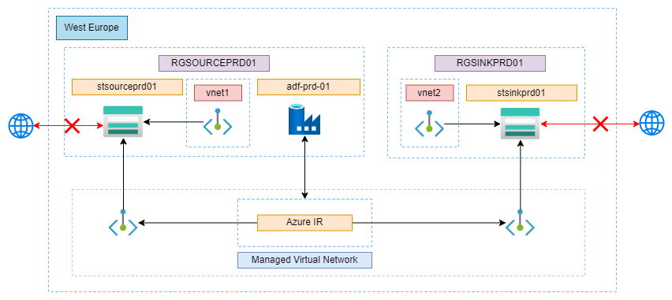

<!-- ABOUT THE PROJECT -->
## DataFactory Project

The DataFactory Project is meant to provide a solution to the following description: 

`Develop a Bicep/ARM template with the primary objective of facilitating the seamless deployment of an Azure Data Factory (ADF). The intended functionality of the deployed ADF is to efficiently transfer data from Storage Account 1, residing within Virtual Network 1 (VNet1), to Storage Account 2, situated within Virtual Network 2 (VNet2).` 

While it is not possible for a storage account to reside or be situated in a virtual network, I will instead create a private endpoint for each storage account and place that in the vnets as described. 

For the task of copying, I found three ways to setup the ADF to be able to copy from one storage account to another: 

1. Allow public access on the storage accounts and connect directly to the storage accounts from the ADF. 
2. Create a managed virtual network on the ADF integration runtime, and connect the storage accounts to the managed virtual network using managed private endpoints.  

The third option I discovered too late, however, I believe it is the best solution for this project. The storage accounts would be deployed with a private endpoint in their respective Vnet. The ADF would use a self-hosted integration runtime (SHIR) running in a separate Vnet and it should be able to connect to Vnet1 and Vnet2 as described in the problem description. Then by allowing the SHIR machine's IP access to the storage accounts, you could add the private endpoints as part of the linked services for the ADF. To deploy the SHIR script to the VM, you would need to store the SHIR script in a storage account and have another data factory deploy the script to the virtual machine for every redeployment. 

I ended up going with option 2 because I was already done with it before I found out about option 3. Architecture overviews for option 1 and 3 can be found in the folder `imgs`.

 

Everything is deployed using a YAML pipeline and all resources are defined through Infrastructure as Code (IaC) using Bicep. 

The Azure Data Factory is deployed to a source resource group along with a storage account, and a single storage account is deployed to a sink resource group. The Azure Data Factory uses a custom Azure-hosted Integration Runtime for processing tasks. 

For the network, the project uses a Managed Virtual Network, where each Storage Account is connected using Managed Private Endpoints. Public access has been disabled for the Storage Accounts to ensure tight security. To adhere to the problem description, I also created a vnet and a subnet for each storage account and added a private endpoint. 

## Getting Started

The following will instruct on how to setup the project locally. 

### Prerequisites

* If you are using a self-hosted agent, make sure it is able to use az commands. 
* An Azure account.

### Setting the project up

Certain parts of the project need to be manually setup. In this section I will go through the individual requirements. 

#### Azure
* Create a subscription and add the subscription ID to the value of `subscriptionName` in the `pipeline/main.yml` file. Make sure to push this change. 
* Make sure the service principal created in DevOps is added as a contributor for the the subscription.
* If you want to copy a specific file, add the file name to the `fileName` value in `infrastructure/main.parameters.json`. Make sure to push this change. 
* If you want to copy an entire folder, leave the `fileName` value as an empty string and edit the `folderPathSource` and `folderPathSink` values. Make sure to push this change. 
* To ensure you have access to the storage accounts, enter your external IP address in the `allowedIp` value of the `main.paameters.json` file. Make sure to push this change. 

#### DevOps

* Create a new project and import this code.
* Create a DevOps environment and edit the variable `environmentName` in `pipeline/main.yml`. Make sure to push this change. 
* Create an Azure Resource Manager service connection using Service Principal (automatic) and edit the value of the service connection name variable in `pipeline/main.yml`. Make sure to push this change. 
* If you are using a self-hosted agent, edit the value of the self-hosted agent name `agentName` in `pipeline/main.yml`. Make sure to push this change. 
* Create a new pipeline and make it use the existing pipeline definition in `pipeline/main.yml`. 

<!-- USAGE EXAMPLES -->
## Usage

The project is rather simple to use, however, it consist of five manual steps that have to be followed to make sure everything is working. 

* Start the pipeline created in DevOps and deploy all the resources to Azure. On the first run, make sure to approve the pipeline using the environment. 
* Once the resources have been deployed, you need to find the storage account in the `sink` resource group, go to networking, go to `private endpoint connections`, click on the private endpoint with status `Pending` and click accept. This can also be done from the Private Link center under `Pending connections`.
* The same has to be done for the storage account in the `source` resource group. 
* Next, you need to upload your file(s) to the `source` storage account by going to `containers`, then choosing the container defined in the `containerNameSource` value in `infrastructure/main.parameters.json`.  
* Finally, open the Azure Data Factory studio, go to `Manage` in the left menubar, go to `Managed private endpoints` and wait until the Approval state shifts from Pending to Approved. Then go to `Author`, expand the pipelines, click the `BlobCopyActivity`, then trigger it. Once it is done running, you should find the file(s) copied in the `sink` storage account. 
